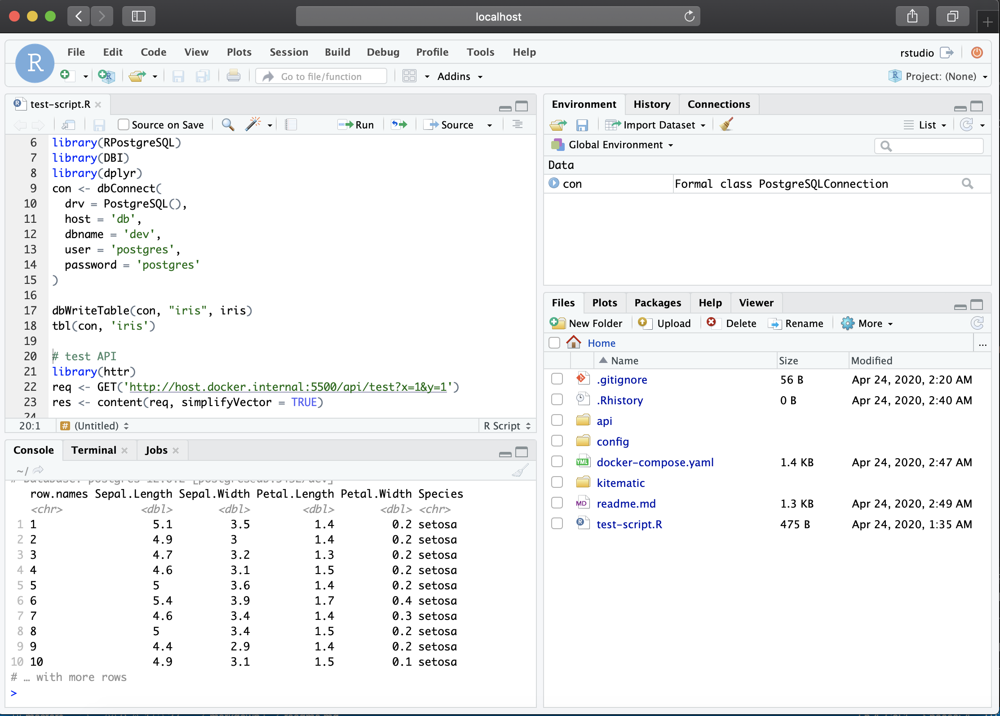

# Rstudio with api and postgresql
A containerised Rstudio instance with a linked api and db. An R studio instance will open with postgreSQL and a plumber API already set up and a persistent volume will be set up for postgres storage.

Rstudio and the plumber API use `nginx` reverse proxy which is accessible on port 5500.

Rstudio is hosted at:
http://localhost:5500/

The API can be accessed at:
http://localhost:5500/api/test?x=1&y=2

The environment comes with PostgreSQL preconfigured with postgis with connection details in `test-script.R`. The postgres username and password each default to 'postgres' and can be changed in `docker-compose.yaml`.

## Running with docker
1. clone the repo `git clone https://github.com/Chrisjb/rstudio-dev-docker.git` 
2. `cd` to our project folder
3. run `docker-compose up`
4. when finished run `docker-compose down`

If you see the error:

>Error in postgresqlNewConnection(drv, ...) : 
>  RS-DBI driver: (could not connect postgres@db:5432 on dbname "dev": could not connect to server: Connection refused
>	Is the server running on host "db" (172.26.0.2) and accepting
>	TCP/IP connections on port 5432?
>)

The database has likely not finished building yet. This can take some time the first time the container is run. The api will also refuse to connect initially for the same reason.
